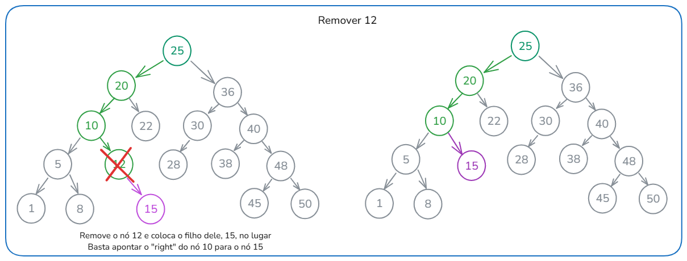

# Projeto final árvores

## Alunos

- José Jefferson Dantas Araújo
- Marcos Paulo Santos Lira

## BST (Árvores Binária de Busca - _Binary Search Tree_)

- É uma árvore binária, ou seja, cada nó tem 0, 1 ou 2 filhos
- Os nós tem posições fixas: esquerda e direita
- O nó filho da esquerda é sempre menor que o nó pai
- O nó filho da direita é sempre maior que o nó pai
- Facilita a busca rápida de dados, pois conseguimos saber em qual lado da árvore continuar a busca
- Pode reduzir o tempo de pesquisa pela metade


## Encontrar um nó na árvore

Para encontrar um nó na árvore, vamos criar uma função recursiva que vai percorrendo as sub-árvores até encontrar o nó que queremos

```javascript
// Procura um valor na árvore recursivamente
// value: valor a ser procurado
// current: nó atual da árvore, começa na raiz
search(value, current = this.root) {

}
```

Primeiro verificamos se o nó atual é nulo, se for, retornamos nulo, pois o valor não existe na árvore

```javascript
// Se o nó atual for nulo, o valor não existe na árvore
if (current === null) {
  return null
}
```

Se o valor for menor que o valor do nó atual, obtemos a sub-árvore da esquerda e continuamos a busca recursivamente. A mesma coisa se o valor for maior, nesse caso percorremos a sub-árvore da direita

```javascript
// Se o valor for menor que o valor do nó atual, procura à esquerda
if (value < current.value) {
  return this.search(value, current.left)
}

// Se o valor for maior que o valor do nó atual, procura à direita
else if (value > current.value) {
  return this.search(value, current.right)
}
```

E se o valor for igual ao valor do nó atual, significa que encontramos o nó que queríamos e retornamos ele

```javascript
// Se o valor for igual ao valor do nó atual, o valor é o nó atual
else {
  return current
}
```

## Inserção de dados

### Primeiro exemplo


### Segundo exemplo


### Código para inserção de dados

Essa é uma função recursiva que insere um novo nó na árvore

```javascript
// Insere um nó na árvore (current é a árvore atual)
// node: nó a ser inserido
// current: nó atual da árvore, começa na raiz
insert(node, current = this.root) {
  // Se o nó da raiz for nulo, o nó ficará na raiz
  if (this.root === null) {
    this.root = node
  }

  // Se o nó raiz não for nulo
  else {
    // Se o valor do novo nó for menor que o valor do nó atual, ele ficará à esquerda
    if (node.value < current.value) {
      // Se o nó da esquerda for nulo, insere ele aqui
      if (current.left === null) {
        current.left = node
      }

      // Se o nó da esquerda não for nulo, procura o nó no nível mais abaixo para inserir
      else {
        this.insert(node, current.left)
      }
    } else {
      // Se o nó da direita for nulo, insere ele aqui
      if (current.right === null) {
        current.right = node
      }

      // Se o nó da direita não for nulo, procura o nó no nível mais abaixo para inserir
      else {
        this.insert(node, current.right)
      }
    }
  }
}
```

## Remoção de dados

Para remover o nó, vamos criar uma função que retorna a árvore sem o nó que queremos remover

```javascript
// Apaga um nó da árvore, para fazer isso, chama a função recursiva removeNode que retorna a árvore atualizada
// value: valor do nó a ser deletado
remove(value) {
  this.root = this.removeNode(value)
}
```

Essa função é recursiva e vai percorrer a árvore até encontrar o nó que queremos remover.

```javascript
// value: valor do nó a ser deletado
// current: nó atual da árvore, começa na raiz
removeNode(value, current = this.root) {

}
```

Primeiro verificamos se o nó atual é nulo, se for, retornamos nulo, pois a árvore está vazia

```javascript
// Se o nó atual for nulo, a árvore está vazia
if (current === null) {
  return null
}
```

Depois percorremos pela árvore para encontrar o nó que queremos remover

```javascript
// Se os dados a serem excluídos são menores que os dados atuais, percorre à esquerda
if (value < current.value) {
  // Substitui a parte esquerda da árvore pelo resultado da função recursiva
  current.left = this.removeNode(value, current.left)
  return current
}

// Se os dados a serem excluídos são maiores que os dados atuais, percorre à direita
else if (value > current.value) {
  // Substitui a parte direita da árvore pelo resultado da função recursiva
  current.right = this.removeNode(value, current.right)
  return current
}
```

Existem 3 casos para a remoção de um nó:

### 1. O nó não tem filhos

Nesse caso, basta procurar o nó e removê-lo


```javascript
// Se o nó NÃO CONTÉM FILHOS, deleta ele
// Retornando null, a função recursiva vai substituir o nó por null
if (current.left === null && current.right === null) {
  return null
}
```

### 2. O nó tem um filho

Nesse caso, basta remover o nó e colocar o filho no lugar dele



```javascript
// Se o nó CONTÉM UM FILHO, deleta o nó e retorna o filho
// Retornando o filho, a função recursiva vai substituir o nó pelo filho
if (current.left === null) {
  return current.right
} else if (current.right === null) {
  return current.left
}
```

### 3. O nó tem dois filhos

Nesse caso, é um pouco mais complexo. Precisamos encontrar o nó mais à esquerda da árvore da direita e substituir o nó que queremos remover por ele

Esse nó será o menor número que seja maior que o nó que queremos remover


```javascript
// Se o nó contém DOIS FILHOS, substitui o valor do nó pelo valor do sucessor
// O sucessor é o nó com o menor valor, mas ainda sim maior que o nó a ser deletado
// Procura o nó com o menor valor na árvore da direita (pois a árvore esquerda só contém valores menores)
const minNode = this.findMinNode(current.right)

// Substitui o valor do nó atual pelo valor do sucessor
current.value = minNode.value

// Procura e deleta o sucessor da árvore da direita
current.right = this.removeNode(minNode.value, current.right)

return current
```
